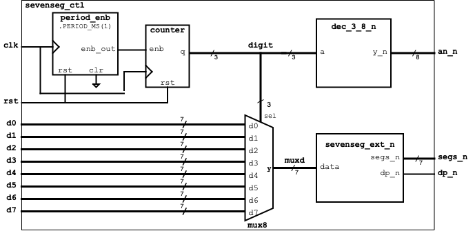

# sevenseg_ctl - NexysA7 7-Segement Display Controller
## ECE 212 - Digital Circuits II
This module implmements an extended 8-digit seven-segment controller for the Nexys A7 board using modules in the SV_Examples repository.

Each digit has been extended to be a 7-bit value
which provides blanking, decimal point, and dash
(minus sign) as options.

All of the submodules used in this desgin are
available in the SV_Examples directory except 
for the extended 7-segment controller that you designed in Lab 1.

| Input | Function |
| ----------- | ----------- |
| di[6] | blank (turns of display when blank=1 |
| di[5] | dp displays decimal point when asserted and blank=0 (active high) |
| di[4] | dash displays a dash/minus sign when asserted and blank=0 |
| d[3:0] | binary value to be displayed as a hexadecimal digit when minus=0 and blank=0 with special characters 'A' (4d10), 'P' (4'd11), and F (4'd15) |

